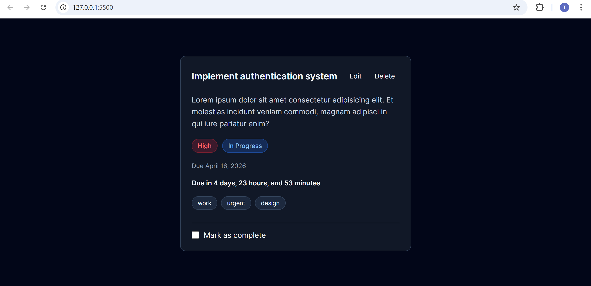

# Stage 0 - Todo Card

A clean, responsive, and interactive Todo / Task Card component built with **HTML, CSS, and Vanilla JavaScript** as part of the HNG Stage 0 Frontend task.

---

## Live Demo

[https://stage-0-hng-task-card.vercel.app/](https://stage-0-hng-task-card.vercel.app/)

## Preview



---

## Built With

- HTML5 (Semantic markup)
- CSS3 (Flexbox, responsive design, variables)
- Vanilla JavaScript (DOM manipulation, state handling)

---

## Features

- Dynamic time remaining calculation
- Smart due date formatting
- Interactive checkbox to mark task as complete
- Status updates (In Progress → Done)
- Overdue detection
- Edit and delete button (dummy interaction)
- Fully responsive layout (320px – 1200px)

---

## Key Functionalities

### Time Remaining

The app calculates and updates remaining time based on the task due date:

- Due in X days, Y hours, and Z minutes
- Due tomorrow
- Due now!
- Overdue by X time

Updates automatically every 60 seconds thanks to `setInterval`.

---

### Task Completion

When the checkbox is toggled:

- Task title gets strikethrough
- Status changes to "Done"
- UI updates instantly

---

### State Handling

The UI dynamically updates based on:

- Task completion status
- Current time vs due date
- User interactions

---

## Project Structure

```

project-folder/
│
├── /assets
├── index.html
├── style.css
├── script.js
├── preview.png
└── README.md

```

---

## How to Run the Project

1. Clone the repository:

```bash

git clone https://github.com/justtimi/stage-0-hng-task-card.git

```

2. Open the project folder:

```bash

cd stage-0-hng-task-card

```

3. Open `index.html` in your browser.

---

## Data Attributes

This project uses required `data-testid` attributes:

- `test-todo-card`
- `test-todo-title`
- `test-todo-description`
- `test-todo-priority`
- `test-todo-status`
- `test-todo-due-date`
- `test-todo-time-remaining`
- `test-todo-complete-toggle`
- `test-todo-tags` and then the respective attribute for each tag.
- `test-todo-edit-button`
- `test-todo-delete-button`

---

## What I Learned

- **DOM manipulation in vanilla JavaScript**:
  Since I’ve been working primarily with React, this project helped me reconnect with core JavaScript fundamentals. It reinforced how state management works conceptually and how frameworks abstract those same patterns.

Coding this in pure JavaScript helped me understand how React handles state and UI updates behind the scenes. I also learned best practices such as maintaining **a single source of truth** to avoid inconsistencies.

Initially, I was defining the "done" state in two different places. One for the status pill and another for the heading and time text. I later realized this was not good practice, so I centralized all related logic inside `updateTimeRemaining()`.

```js
const updateTimeRemaining = () => {
  if (!time || !timeRemaining) return;
  const dueDateString = time.getAttribute("datetime");

  const dueDate = new Date(dueDateString);
  const now = new Date();
  const difference = dueDate - now;

  const days = Math.floor(difference / (1000 * 60 * 60 * 24));
  const hours = Math.floor(difference / (1000 * 60 * 60)) % 24;
  const minutes = Math.floor(difference / (1000 * 60)) % 60;

  if (checkbox.checked) {
    timeRemaining.textContent = "Done";
    timeRemaining.classList.remove("overdue");
    statusPill.textContent = "Done";
    statusPill.classList.remove("status-inprogress", "status-overdue");
    statusPill.classList.add("status-done");
    heading.classList.add("completed");
    return;
  }

  heading.classList.remove("completed");

  if (difference <= 0) {
    const absDifference = Math.abs(difference);

    const overdueDays = Math.floor(absDifference / (1000 * 60 * 60 * 24));
    const overdueHours = Math.floor(absDifference / (1000 * 60 * 60)) % 24;
    const overdueMinutes = Math.floor(absDifference / (1000 * 60)) % 60;

    if (overdueHours < 1 && overdueDays < 1) {
      timeRemaining.textContent = `Overdue by ${overdueMinutes} minutes`;
    } else if (overdueDays < 1) {
      timeRemaining.textContent = `Overdue by ${overdueHours} hours and ${overdueMinutes} minutes`;
    } else {
      timeRemaining.textContent = `Overdue by ${overdueDays} days, ${overdueHours} hours, and ${overdueMinutes} minutes`;
    }

    timeRemaining.classList.add("overdue");
    statusPill.textContent = "Overdue";
    statusPill.classList.remove("status-inprogress", "status-done");
    statusPill.classList.add("status-overdue");
    return;
  }
  timeRemaining.classList.remove("overdue");
  statusPill.classList.add("status-inprogress");
  statusPill.classList.remove("status-overdue", "status-done");
  statusPill.textContent = "In Progress";

  if (difference < 60000) {
    timeRemaining.textContent = "Due now";
  } else if (difference < 3600000) {
    timeRemaining.textContent = `Due in ${minutes} minutes`;
  } else if (days === 1) {
    timeRemaining.textContent = "Due tomorrow";
  } else if (days > 1) {
    timeRemaining.textContent = `Due in ${days} days, ${hours} hours, and ${minutes} minutes`;
  } else if (days < 1) {
    timeRemaining.textContent = `Due in ${hours} hours, and ${minutes} minutes`;
  }
};
```

That alone was most of the logic of the application.

- **Date/time calculations in JS**:
  This project gave me hands-on experience working with the Date() object. I learned how to use the <time> element properly and leverage its datetime attribute for structured, machine-readable date values.

My process was:

1. Create the <time> element in HTML and target it in JavaScript.
2. Retrieve the datetime attribute and parse it into a Date object.
3. Calculate the difference between the current time and the due date.
4. Convert the difference into days, hours, and minutes for display logic.

I also learned that for more precise conditional checks, it is better to use the raw millisecond difference value rather than derived values like days or hours.

- **UI state management without frameworks**: The UI is now driven by a **config-based state system**, which improves scalability and reduces repetition.

Instead of hardcoding UI updates in multiple places, the app uses a centralized state configuration:

```js
const STATUS_CONFIG = {
  done: { text: "Done", class: "status-done", headingClass: "completed" },
  overdue: { text: "Overdue", class: "status-overdue", headingClass: "" },
  inprogress: {
    text: "In Progress",
    class: "status-inprogress",
    headingClass: "",
  },
};
```

- **Accessibility basics (aria-labels, semantic HTML)**:
  The project brief included specific accessibility requirements, which I implemented carefully. I learned about the aria-live attribute and how it helps announce dynamically changing content to assistive technologies. I also added support for users with motion sensitivity:

```css
@media (prefers-reduced-motion: reduce) {
  * {
    transition: none !important;
  }
}
```

This was my first time implementing proper focus states in CSS. I learned the difference between :focus and :focus-visible, ensured good color contrast, and made all interactive elements keyboard accessible.

- **Building testable UI components**:
  This project improved my awareness of edge cases. In production-grade applications, elements may be conditionally rendered. If we attach event listeners to elements that do not exist, it can cause runtime errors due to _null_ references. I implemented defensive checks to prevent such crashes and ensure safer DOM interactions.

- **Implementing checks for Cumulative Layout Shift (CLS)**:
  I applied prior knowledge of CLS while building the UI. Initially, I used borders for button focus states, which caused slight layout shifts when clicked. I corrected this by using outlines instead, preventing unexpected movement and maintaining layout stability.

## Why This Project Matters

This project demonstrates my ability to:

- Build interactive UI components from scratch
- Handle dynamic state without frameworks
- Think through edge cases
- Write maintainable, testable frontend code

## Technical Decisions

- Used vanilla JavaScript instead of a framework to demonstrate strong foundational DOM and state management knowledge.
- Centralized state logic inside `updateTimeRemaining()` to maintain a single source of truth.
- Used `setInterval` with a 60-second interval to balance real-time updates and performance.
- Relied on semantic HTML elements such as `<article>` and `<time>` to improve structure and accessibility.
- Used CSS variables for maintainable and scalable styling.
- Implemented defensive null checks before manipulating DOM elements to prevent runtime errors.

**NOTE**: The project was refactored to improve readability and scalability.

Key improvements include:

#### 1. Centralized Status System

All task states (Done, Overdue, In Progress) are now defined in a single configuration object.

#### 2. Reusable UI Function

A `setStatus()` function was introduced to handle all UI updates consistently:

- Updates status text
- Controls CSS classes
- Manages heading state
- Reduces duplicate DOM manipulation logic

#### 3. Class Management Optimization

A shared array of status classes is used to reset UI state efficiently:

```js
const STATUS_CLASSES = ["status-overdue", "status-inprogress", "status-done"];
```

## Future Improvements

If this were extended into a production-ready application, I would:

- Persist tasks using LocalStorage or a backend API
- Allow dynamic task creation instead of static content
- Implement unit tests (Jest / Testing Library)
- Add multi-theme support

## Conclusion

Thank you for reading!
